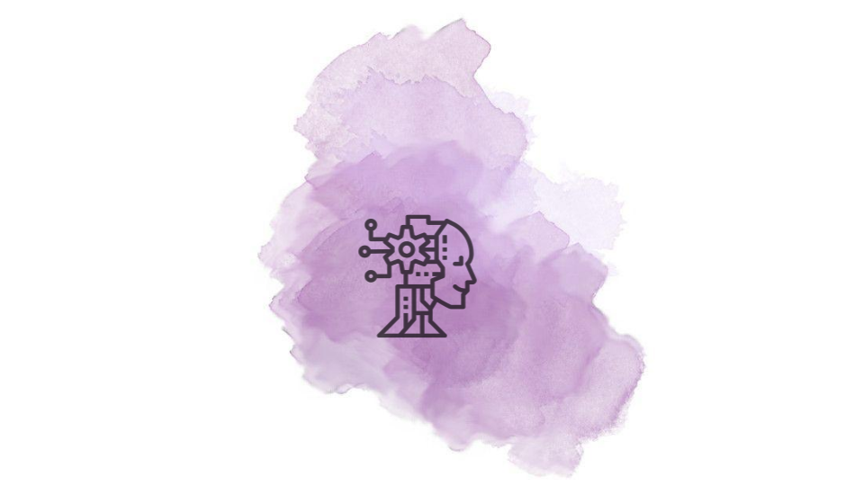

# Amethyst

## 📜 Description

Amethyst project was born to implement AI functions and improving the knowlegment about how neurons works.

## ⚙ How to contribute?

1. Fork this project.

2. Clone to your machine.

3. Do some stuff.

4. `git add .`, `git commit -m "my commit"`, `git push origin <your_branch>` and generate a merge request.

## 📝 License

This project is under the MIT license. See the file [LICENSE](LICENSE) for more details.
